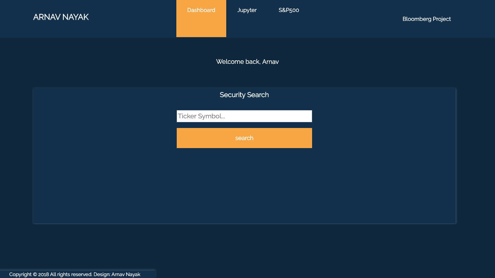
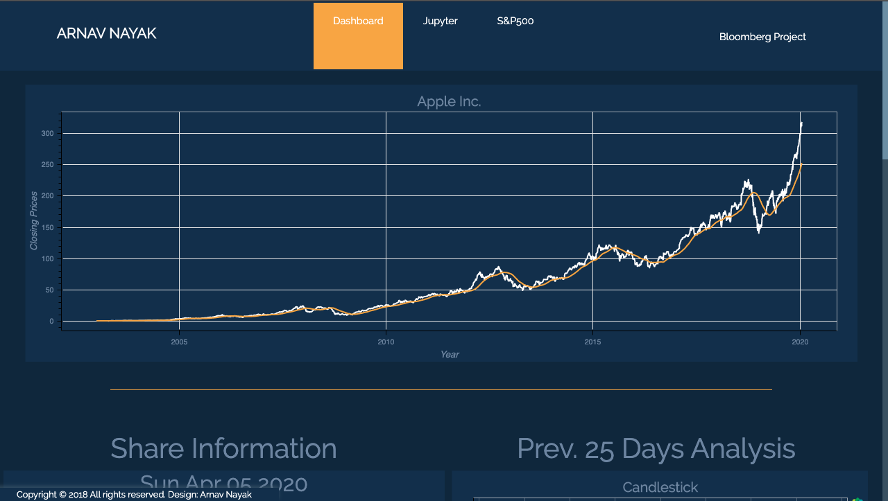
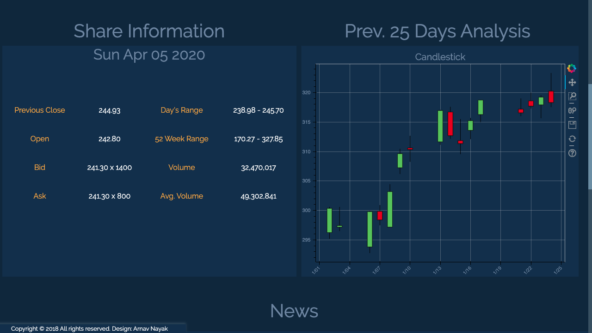
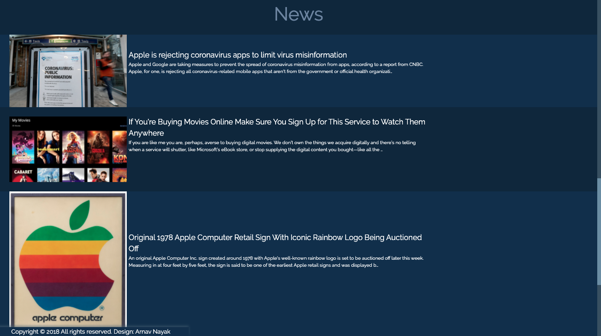
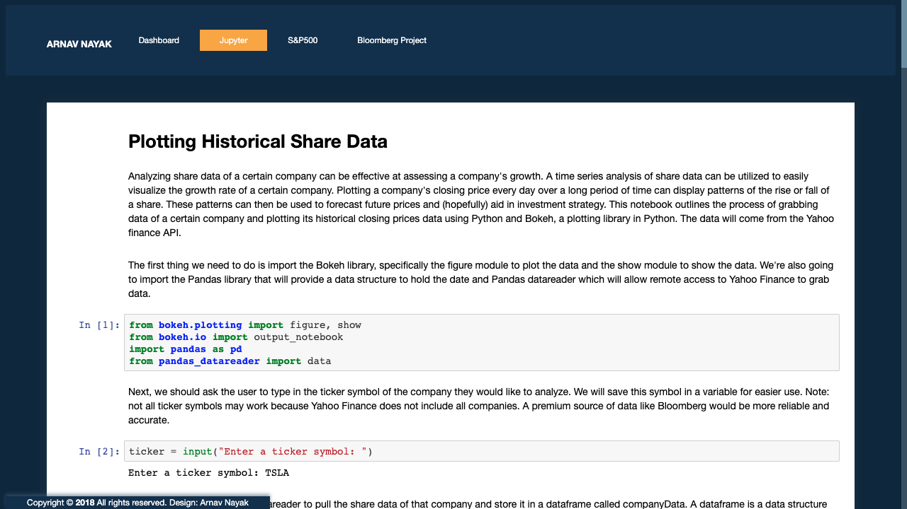
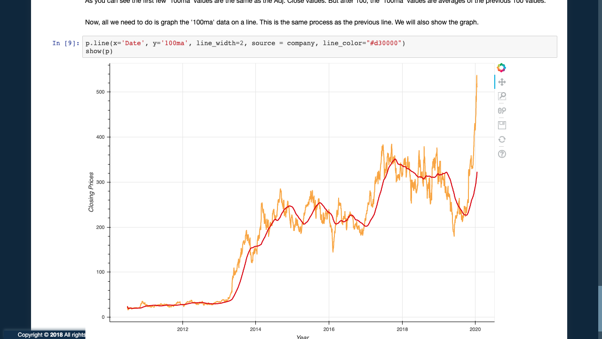
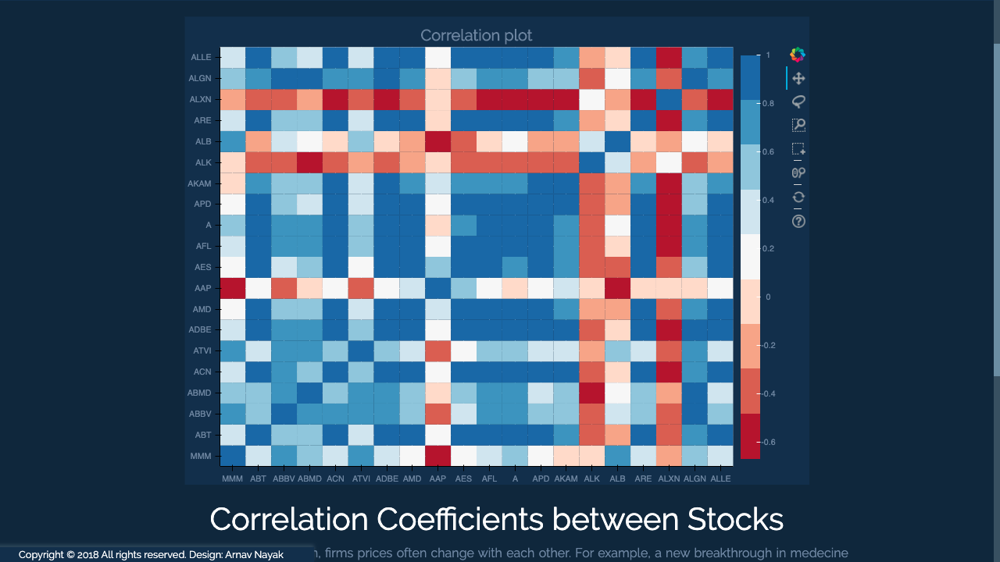

# Bloomberg Data Visualization Project

## Description
In my junior year, the Bloomberg Data center by Princeton was offering some students the opportunity to create a project that involved data visualization. I made a web application with Flask that allows users to type in the ticker symbol of any company they like, and see a time series analysis of the company's share prices. The web app also uses web scraping to collect data from the Yahoo finance page for data points related to the stock, a candlestick chart that shows open, low, high and close prices, and news of that particular company. There is also a Jupyter notebook file, outlining the code used to grab and create the visuals. The visuals were made using Bokeh plots.

On the last tab, there is a correlation coefficient graph with the top 25 S&P500 companies. Being such a volatile market, finding correlation between the price movements of two companies is important to minimize risk in a portfolio, or doubling down on risk for a greater return. 

## Pictures

    

  Home Page

  
  
  
  
  Deshboard
  
  
  
  Jupyer Notebook
  
  
  Correlation Chart

## Technoloties
- 
- 
- 
- 
- [BeautifulSoup](https://www.crummy.com/software/BeautifulSoup/bs4/doc/) - Web scraping API
- [Bokeh](https://docs.bokeh.org/en/latest/index.html) - The Visualization API
